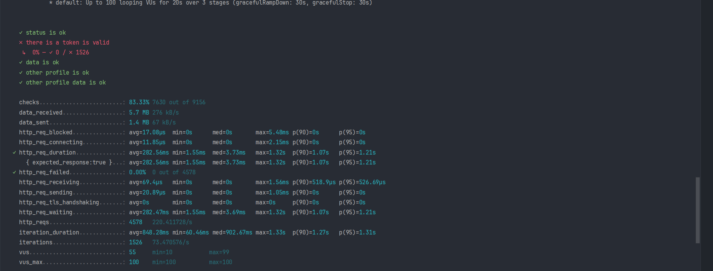
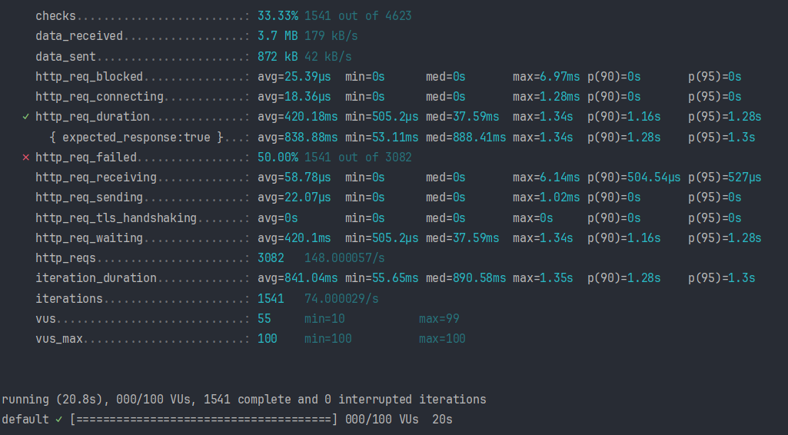

<h1 style="text-align: center">Tugas Besar 2 Pengembangan Aplikasi Web</h1>

## Daftar Isi
- [Deskripsi](#deskripsi)
- [Instruksi Penggunaan](#instruksi-penggunaan)
- [Kontributor](#kontributor)

## Deskripsi

## Instruksi Penggunaan
### Dependencies
- Node.js
- npm
- Docker
- PostgreSQL
- Redis
- Port available in 3000, 5137, 9091

**NOTE:** Jalankan program dengan cara development

### Cara Memasang Aplikasi (Development)
1. Jalankan frontend di folder frontend dengan perintah
```sh
cd frontend
npm install --log-level verbose
```
2. Install dependencies di backend
```sh
cd backend
npm install --log-level verbose
```
3. Buat .env dari .env.example di backend
4. Jalankan backend di folder backend dengan Docker Compose
```sh
docker compose up --build
```
5. Jalankan frontend di folder frontend dengan perintah
```sh
npm run dev
```
6. Untuk mengakses API, buka http://localhost:3000/api
7. Untuk mengakses frontend, buka http://localhost:5137
8. Jika ada error Express, jalankan
```sh
docker compose exec backend npm install express
```
9. Jika ada error bahwa OS untuk ESLint memakai Windows atau error lainnya, hapus folder node_modules, hapus package-lock.json, pastikan
 package-lock.json di backend tidak ada, dan jalankan kembali docker dari build image
10. Untuk debugging backend lebih lanjut, jalankan
```sh
docker compose exec backend /bin/sh
```
11. Jika mengubah database, ubah di backend/prisma/prisma.schema, kemudian di CLI folder backend jalankan (ganti nama migrasi)
```sh
docker compose exec backend npx prisma migrate dev --name [nama-migrasi]
docker compose exec backend npx prisma generate
```
12. Jika mengubah database, data akan hilang. Edit file backend/prisma/seed.ts, kemudian buka http://localhost:3000/api/seed untuk mengisi data lagi

### Cara Memasang Aplikasi (Production)
1. Clone repository ini
2. Hapus seluruh image, volume, container di Docker sebelumnya jika sudah pernah menjalankan aplikasi ini
```sh
docker compose --env-file ./backend/.env down --volumes
```
3. Install dependencies di frontend dan backend
```sh
cd frontend
npm install
cd ../backend
npm install
```
4. Buat .env dari .env.example di backend. **Jangan ganti nilai POSTGRES_HOST**, dan hapus package-lock.json
5. Jalankan docker compose di root
```sh
docker compose --env-file ./backend/.env build --no-cache
```
6. Jalankan container docker compose
```sh
docker compose --env-file ./backend/.env up
```
7. Untuk mengakses API, buka http://localhost:3000/api
8. Untuk mengakses frontend, buka http://localhost:5137

### Cara Menjalankan Aplikasi
1. Jalankan container docker compose
```sh
docker compose --env-file ./backend/.env up
```
2. Untuk mengakses API, buka http://localhost:3000/api
3. Untuk mengakses frontend, buka http://localhost:5137

### Cara Menghentikan Aplikasi
1. Hentikan proses di terminal dengan `Ctrl + C`
2. Hentikan container docker compose
```sh
docker compose --env-file ./backend/.env down --volumes
```
3. Jika ingin menghapus seluruh build, jalankan
```sh
docker builder prune --all
```

### Test Result
1. Profile Test

2. Feed Test


## Kontributor

### Spesifikasi Wajib
- Authentication & authorization: 13522071
- Profil pengguna: 13522102, 13522112
- Feed: 13522102, 13522112
- Chat dan websocket: 13522112
- Notifikasi: 13522071
- Stress dan load test: 13522071
- Responsivitas: 13522102, 13522112
- Docker: 13522071
- Daftar pengguna: 13522102, 12522112
- Koneksi, daftar koneksi, permintaan koneksi: 13522102
- 
- ### Bonus
- UI/UX Linkedin: 13522112, 13522102
- Caching: 13522071
- Recommendation: 13522112, 13522102